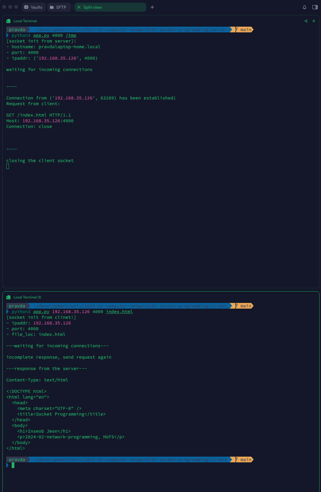
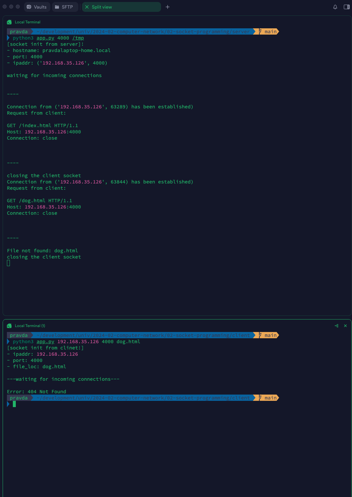

# Socket Programming Assignment To-Do List

Inseob Jeon(201603001, HUFS)

---

## Results

### How to execute

```shell
python3 server/app.py ${port_no} ${dir}
python3 client/app.py ${ip_addr} ${port_no} ${file_name}
```

### Success case



### Failure case



### Conclusion

#### Understanding the Process of Connection Establishment in Practice

Although Python provides a well-abstracted interface for managing sockets, this assignment was a valuable opportunity to understand the underlying process more deeply.

As outlined in the assignment requirements, I used methods such as `socket()`, `connect()`, `send()`, `recv()`, `close()`, `bind()`, `listen()`, and `accept()`.

First, I created a socket instance using `socket()`. After that, I bound the `port number` and `host` to the socket and used `listen()` with a `backlog` parameter to specify the number of connections the server could queue. The server then waited for client-side socket connections.

When a client attempted to connect via a socket, I used the `accept()` method to establish the connection. However, there is currently no validation on the connection acceptance, which should be improved in the future.

To receive data from the client, I implemented a `recvall` function using a buffer and the `recv()` method for more explicit handling. I used `recv()` with a specified buffer size, concatenating the incoming data until no additional input was available, and then returned the result. The `main()` function processed the binary response and decoded it into a UTF-8 string.

#### Areas for Improvement

##### Parsing HTTP Requests/Responses

I used regular expressions to parse HTTP requests and responses. However, according to the HTTP specification (RFC), I should incorporate the `Content-Length` header or an end marker like `\r\n` for more accurate parsing.
